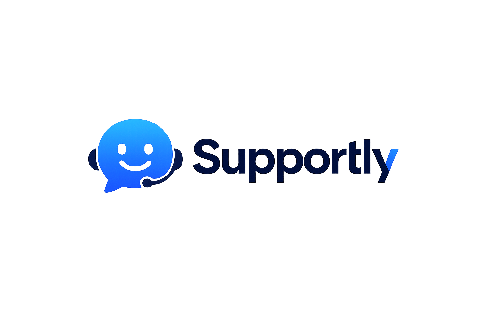
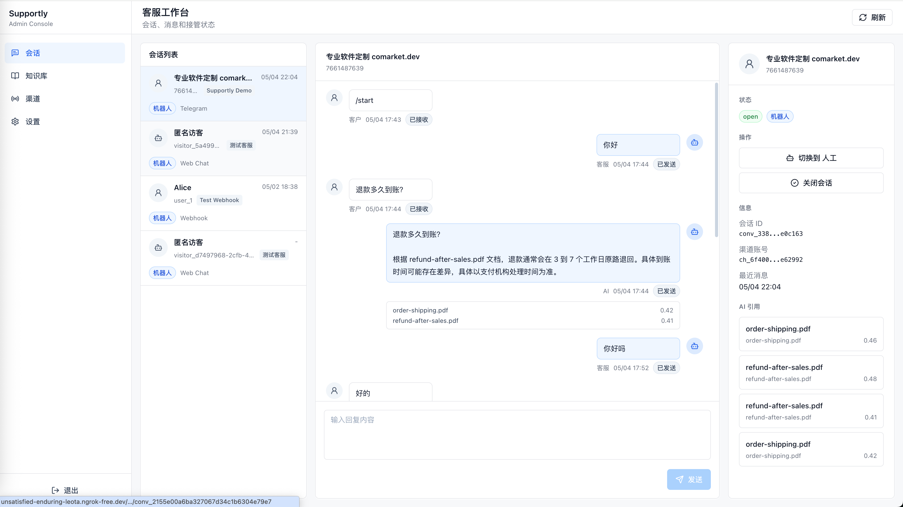
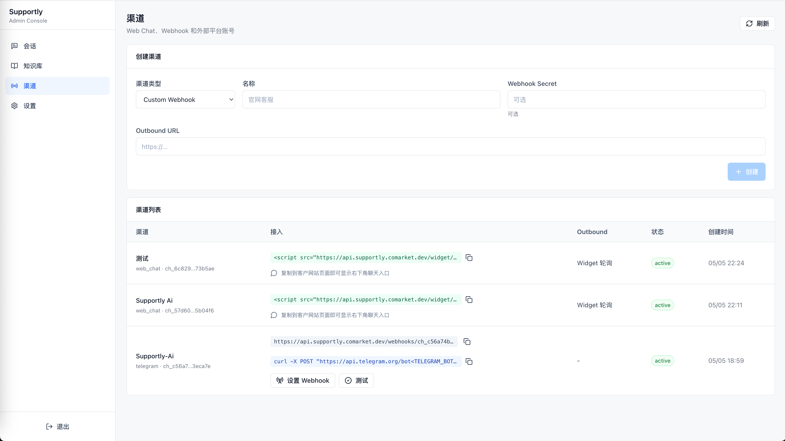
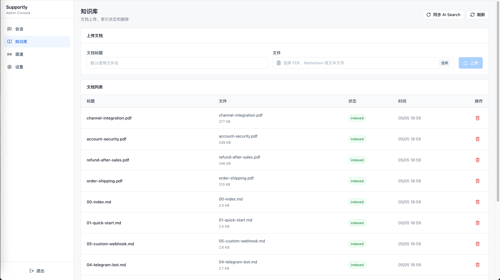
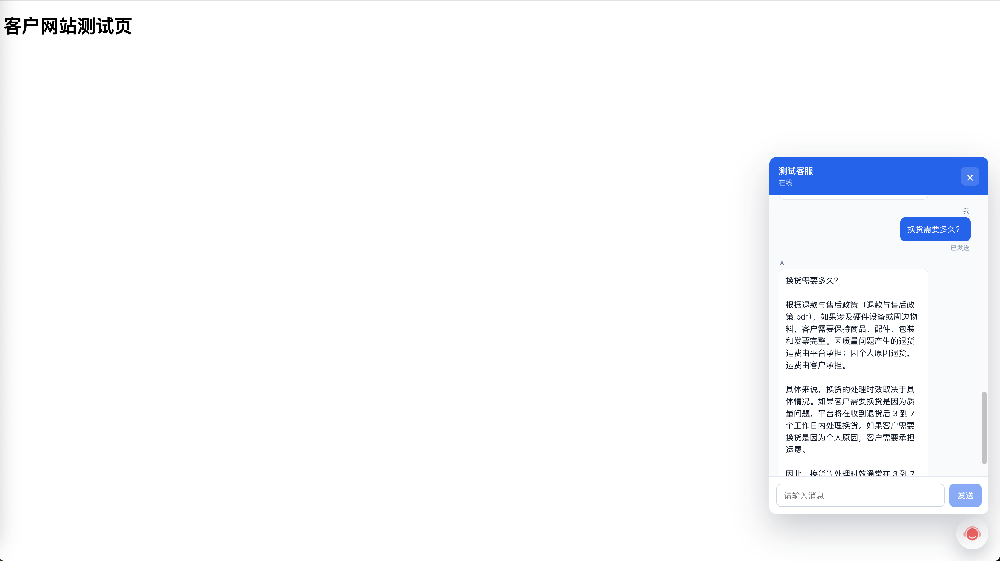
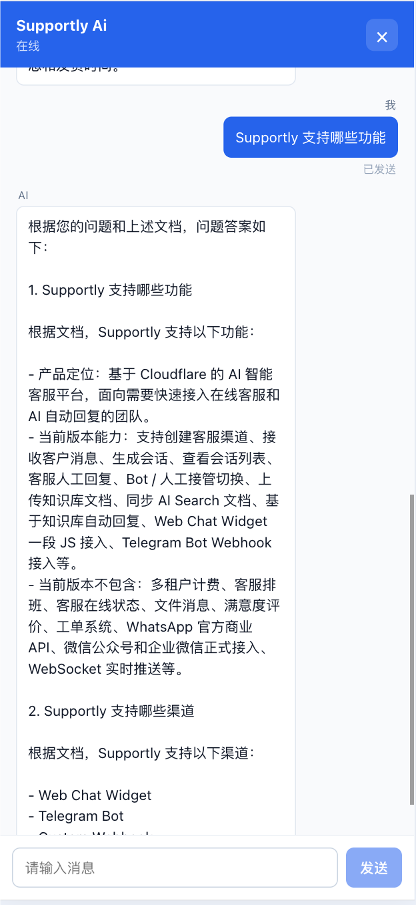
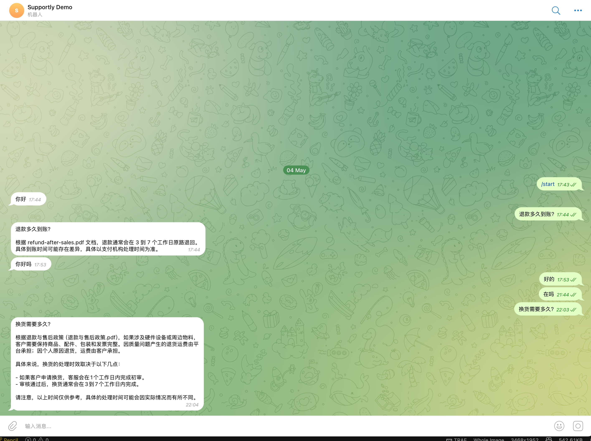

# Supportly Server API（免费自部署智能客服后端）

> 免费、自部署、Cloudflare 原生的智能客服后端。把 Web Chat Widget、Telegram Bot 和自定义 Webhook 汇入统一会话，用知识库 + Workers AI 自动回复，先把客服系统跑起来。


## 为什么免费

- **项目本身免费**：后端、Admin、Web Chat Widget 的核心链路面向免费自部署场景设计。
- **没有坐席费**：单实例版本不内置订阅、坐席限制、会话数限制或渠道加价逻辑。
- **不用先买客服 SaaS**：小团队可以先用自己的 Cloudflare 账号部署，跑通在线客服、知识库和 AI 回复。
- **费用边界清楚**：Cloudflare Workers、D1、AI Search、Workers AI、Telegram 等第三方资源可能按平台规则产生费用；这里的“免费”指 Supportly 项目本身不收取产品费用。

## 开箱能力

```text
免费接入 Web Chat Widget / Telegram / Custom Webhook
免费管理客服会话、未读消息和人工回复
免费上传知识库并同步到 AI Search
免费启用知识库驱动的 AI 自动回复
免费部署 Admin 后台和 Server API 到 Cloudflare Workers
```

`本项目需要 Node.js 20 或以上环境`

`本项目使用 pnpm 管理依赖`

`本项目运行在 Cloudflare Workers Runtime，不是传统 Node.js Server`

<p align="center">
  
</p>

| 模块            | 说明                                                                          |
| --------------- | ----------------------------------------------------------------------------- |
| 运行平台        | Cloudflare Workers                                                            |
| 数据库          | Cloudflare D1                                                                 |
| 媒体附件        | Cloudflare R2                                                                 |
| 知识库          | Cloudflare AI Search                                                          |
| AI 模型         | Cloudflare Workers AI                                                         |
| 后台项目        | [admin](https://github.com/unicornB/Supportly-Ai-Admin.git)                   |
| Web Chat Widget | [web-widget](https://github.com/unicornB/Supportly-Ai-Web-Widget.git)         |
| UniApp SDK      | [UniApp-SDK](https://github.com/unicornB/Supportly-Ai-UniApp-SDK.git)         |

## 产品截图

### Admin 后台



后台 Demo：https://supportly.comarket.dev/

```text
账号：admin@example.com
密码：admin123
```

### 渠道管理



### 知识库



### Web Chat Widget

Widget Demo：https://supportly.comarket.dev/demo



<p align="center">
  
</p>

### Telegram Bot



测试 Demo 机器人：[@my_supportly_ai_bot](https://t.me/my_supportly_ai_bot)

QQ 交流群：1081883123

<p align="center">
  
</p>

## 架构图

```text
Customer Channels
  ├─ Web Chat Widget
  ├─ Telegram Bot
  └─ Custom Webhook
        │
        ▼
Cloudflare Worker
  ├─ Hono Router
  ├─ Channel Adapters
  ├─ Conversation Service
  ├─ Message Service
  ├─ Media Service
  ├─ Knowledge Service
  ├─ AI Service
  └─ Auth Service
        │
        ├─ D1
        │   ├─ admin_users
        │   ├─ channel_accounts
        │   ├─ conversations
        │   ├─ messages
        │   └─ kb_documents
        │
        ├─ R2
        │   └─ 图片 / 视频消息附件
        │
        ├─ AI Search
        │   └─ 知识库检索 / 文档同步
        │
        └─ Workers AI
            └─ 基于知识库生成回复
```

## 特点

### 免费自部署优先

Supportly 的第一目标不是把你锁进新的客服 SaaS，而是让你用现有 Cloudflare 账号快速拥有一套可运行、可修改、可迁移的客服后端。

当前免费单实例版本包含：

```text
Admin 后台
Web Chat Widget
Telegram Bot
Custom Webhook
统一会话
知识库
AI 自动回复
```

不包含内置收费墙：

```text
坐席数量限制
会话数量限制
消息数量限制
渠道接入加价
AI 功能订阅开关
```

如果后续扩展多租户、企业权限、审计、计费等 SaaS 能力，也不会影响单实例自部署版本先免费跑起来。

### Cloudflare 原生

只依赖 Cloudflare 产品：

```text
Workers
D1
R2
AI Search
Workers AI
Workers Assets
```

当前不依赖：

```text
Redis
MySQL
PostgreSQL
Elasticsearch
外部向量数据库
外部大模型网关
```

### 通用渠道模型

渠道统一抽象为：

```text
ChannelAdapter
```

当前已实现：

```text
custom_webhook
telegram
web_chat
```

后续接入 WhatsApp、微信、飞书、企微、LINE 等，只需要新增 Adapter，不需要重写会话和消息模型。

### 会话优先

当前版本不是完整 SaaS，而是单实例 MVP：

```text
一个后台
多个渠道
统一会话列表
统一消息表
统一知识库
统一 AI 回复
```

这样可以先把客服核心链路跑通，再做租户、计费、权限、审计等 SaaS 能力。

### 知识库驱动 AI

AI 回复流程：

```text
用户消息
  -> AI Search 检索知识库
  -> Workers AI 生成回答
  -> 写入 messages
  -> 渠道 Adapter 投递或 WebSocket 实时推送
```

如果 AI Search 没有命中文档，当前默认不强行编造回复。

Widget 发送消息时，HTTP 接口只同步完成访客消息写入并立即返回；AI Search / Workers AI 回复在 Worker `waitUntil` 后台任务中生成，完成后通过 WebSocket 推送给访客和 Admin。

图片/视频消息不会触发 AI 自动回复。媒体文件先上传到 R2，再写入 `messages`，最后通过 WebSocket 推送给访客端和 Admin。客户端通过附件读取接口加载缩略图、播放视频或打开大图预览。

## 功能特性

免费单实例版本已经覆盖客服 MVP 的主要链路：

- [x] 后台账号登录
- [x] 默认管理员初始化
- [x] D1 数据库迁移
- [x] 渠道账号管理
- [x] Custom Webhook 接入
- [x] Telegram Bot 接入
- [x] Telegram Webhook 设置和测试
- [x] Web Chat Widget 接入
- [x] UniApp SDK 接入
- [x] 匿名访客会话
- [x] Visitor Token 校验
- [x] 会话列表
- [x] 会话未读数
- [x] 人工回复
- [x] 图片消息
- [x] 视频消息
- [x] 图片点击查看大图
- [x] Bot / 人工接管切换
- [x] 关闭会话
- [x] 消息发送状态
- [x] 知识库文档上传
- [x] AI Search 文档同步
- [x] AI 自动回复
- [x] AI 引用展示
- [x] Admin / Widget 独立静态部署
- [ ] WhatsApp 官方商业 API 接入
- [ ] 微信公众号 / 企业微信接入
- [ ] 多租户 SaaS
- [ ] 客服分配
- [ ] 通用文件消息
- [ ] 满意度评价
- [ ] 工单系统

## 免费快速部署体验

### 1. 安装依赖

在仓库根目录执行：

```shell
pnpm install
```

或只安装后端：

```shell
cd server-api
pnpm install
```

### 2. 配置 Cloudflare 资源

需要准备：

```text
D1 database
R2 bucket
AI Search namespace
AI Search instance
Workers AI binding
Durable Objects migration
```

当前 `wrangler.toml` 示例：

```toml
[[d1_databases]]
binding = "DB"
database_name = "supportly"
database_id = "replace-with-d1-database-id"

[[r2_buckets]]
binding = "MEDIA_BUCKET"
bucket_name = "supportly"
remote = true

[[durable_objects.bindings]]
name = "VISITOR_STREAM"
class_name = "VisitorStream"

[[durable_objects.bindings]]
name = "ADMIN_STREAM"
class_name = "AdminStream"

[[migrations]]
tag = "v1_realtime_streams"
new_sqlite_classes = ["VisitorStream", "AdminStream"]

[[ai_search_namespaces]]
binding = "AI_SEARCH"
namespace = "aidesk"
remote = true

[ai]
binding = "AI"
remote = true

[vars]
KB_INSTANCE_NAME = "supportly-dev"
DEFAULT_AI_MODEL = "@cf/meta/llama-3.1-8b-instruct"
JWT_SECRET = "supportly-dev-secret-change-before-deploy"
WIDGET_TOKEN_SECRET = "supportly-widget-dev-secret-change-before-deploy"
```

生产环境必须替换：

```text
database_id
JWT_SECRET
WIDGET_TOKEN_SECRET
```

`MEDIA_BUCKET` 是聊天图片/视频附件存储。当前示例使用：

```toml
bucket_name = "supportly"
remote = true
```

这表示 `wrangler dev` 本地开发时也会访问真实 R2 bucket。如果希望本地写入 Miniflare 本地 R2，把 `remote = true` 删除或改为 `false`。

R2 bucket 不需要配置公开域名。Supportly 会通过 Worker API 鉴权读取附件：

```text
/api/conversations/:conversationId/messages/:messageId/attachments/:index
/api/widget/conversations/:conversationId/messages/:messageId/attachments/:index
```

### 3. 执行数据库迁移

本地 D1：

```shell
cd server-api
pnpm db:migrate:local
pnpm db:seed:local
```

远程 D1：

```shell
cd server-api
pnpm db:migrate:remote
pnpm db:seed:remote
```

默认管理员：

```text
邮箱：admin@example.com
密码：admin123
```

生产环境请立即修改默认密码。

### 4. 本地启动

```shell
cd server-api
pnpm dev
```

默认访问：

```text
http://localhost:8787
```

健康检查：

```shell
curl http://localhost:8787/health
```

## 源码开发

### 类型检查

```shell
cd server-api
pnpm typecheck
```

### 测试

```shell
cd server-api
pnpm test
```

### 部署

```shell
cd server-api
pnpm deploy
```

## 后台管理系统

Admin 项目在：

```text
../admin
```

本地启动：

```shell
cd admin
pnpm dev
```

默认访问：

```text
http://localhost:5173
```

Admin 与 `server-api` 分开部署，后端 Worker 发布时不再携带 Admin 静态资源。

构建 Admin：

```shell
cd admin
pnpm build
```

生产环境构建 Admin 时，必须显式指定 API 域名。否则 Admin 会把 `/api/*` 请求发到静态站点同域，容易出现 `POST /api/auth/login` 返回 `405 Method Not Allowed`。

```shell
VITE_API_BASE_URL=https://api.supportly.comarket.dev \
VITE_PUBLIC_WEBHOOK_BASE_URL=https://api.supportly.comarket.dev \
VITE_WIDGET_API_BASE_URL=https://api.supportly.comarket.dev \
VITE_PUBLIC_WIDGET_BASE_URL=https://supportly.comarket.dev \
pnpm build
```

域名职责建议：

```text
https://api.supportly.comarket.dev      -> server-api Worker
https://supportly.comarket.dev          -> Admin / Widget 静态资源
```

## Web Chat Widget

Widget 项目在：

```text
../web-widget
```

构建后输出到自己的目录：

```text
../web-widget/dist
```

本地构建：

```shell
cd web-widget
VITE_WIDGET_API_BASE_URL=http://localhost:8787 pnpm build
pnpm preview
```

生产环境构建 Widget 时，`VITE_WIDGET_API_BASE_URL` 应指向 Server API：

```shell
VITE_WIDGET_API_BASE_URL=https://api.supportly.comarket.dev pnpm build
```

接入示例：

```html
<script
  src="http://localhost:5174/widget/supportly.js"
  data-channel-id="ch_xxx"
  data-title="在线客服"
  async
></script>
```

生产环境建议把 `web-widget/dist` 上传到 Cloudflare Pages 或其他静态 CDN，然后在 Admin 中配置：

```text
VITE_PUBLIC_WIDGET_BASE_URL=https://your-widget-domain.com
```

## UniApp SDK

UniApp SDK 项目地址：

```text
https://github.com/unicornB/Supportly-Ai-UniApp-SDK.git
```

UniApp SDK 是纯 JS Headless 客服聊天 SDK，复用 `server-api` 的 Widget API：

```text
发送消息：HTTP POST
接收消息：WebSocket
历史消息：HTTP GET
断线补偿：HTTP GET after=lastMessageId
本地会话：uni storage
```

适合在 App、小程序、H5 等 uni-app 项目中接入 Supportly 客服能力。页面 UI 由业务项目自己实现，SDK 只负责会话初始化、消息发送、实时接收、历史同步和重连。

## Telegram Bot 接入

### 1. 创建 Telegram 渠道

在 Admin 的「渠道」页面创建：

```text
渠道类型：Telegram Bot
Bot Token：从 BotFather 获取
Webhook Secret：随机字符串
Bot Username：可选
```

### 2. 设置 Webhook

Admin 渠道列表中可以直接点击：

```text
设置 Webhook
测试
```

也可以手动调用 Telegram API：

```shell
curl -X POST "https://api.telegram.org/bot<TELEGRAM_BOT_TOKEN>/setWebhook" \
  -H "content-type: application/json" \
  -d '{
    "url": "https://your-api-domain.com/webhooks/ch_xxx",
    "secret_token": "your-webhook-secret",
    "allowed_updates": ["message"]
  }'
```

## Custom Webhook 接入

Webhook 地址：

```text
POST /webhooks/:channelAccountId
```

请求示例：

```json
{
  "event_id": "evt_1",
  "event_type": "message.created",
  "contact": {
    "external_id": "user_1",
    "name": "Alice"
  },
  "message": {
    "external_id": "msg_1",
    "type": "text",
    "text": "退款多久到账？",
    "attachments": []
  },
  "timestamp": "2026-05-02T10:00:00Z"
}
```

如果渠道配置了 `webhookSecretCiphertext`，请求需要带：

```text
x-supportly-signature
```

签名算法：

```text
HMAC-SHA256(secret, rawBody)
```

## API 概览

### 健康检查

```text
GET /health
```

### 登录认证

```text
POST /api/auth/login
GET  /api/auth/me
```

### 后台管理员

```text
GET /api/admin
```

### 渠道

```text
GET  /api/channels
POST /api/channels
POST /api/channels/:id/telegram/set-webhook
POST /api/channels/:id/telegram/test
```

### 会话

```text
GET  /api/conversations
GET  /api/conversations/:id
GET  /api/conversations/:id/messages
POST /api/conversations/:id/messages
POST /api/conversations/:id/messages/media
GET  /api/conversations/:conversationId/messages/:messageId/attachments/:index
POST /api/conversations/:id/handoff
POST /api/conversations/:id/resolve
```

### 知识库

```text
GET    /api/knowledge/documents
POST   /api/knowledge/documents
DELETE /api/knowledge/documents/:id
POST   /api/knowledge/sync/ai-search
```

### Widget 公开接口

Widget API 不使用后台管理员鉴权，使用 visitor token：

```text
POST /api/widget/conversations
POST /api/widget/conversations/:conversationId/messages
POST /api/widget/conversations/:conversationId/messages/media
GET  /api/widget/conversations/:conversationId/messages
GET  /api/widget/conversations/:conversationId/messages/:messageId/attachments/:index
```

### 媒体消息

图片/视频消息使用 `multipart/form-data` 上传。文件写入 R2，D1 的 `messages.attachments_json` 只保存附件元数据。

客服发送图片/视频：

```text
POST /api/conversations/:id/messages/media
Authorization: Bearer <adminToken>
Content-Type: multipart/form-data

file=<image|video>
clientMessageId=admin_xxx
content=可选说明
fileName=可选文件名
mimeType=可选 MIME
```

访客发送图片/视频：

```text
POST /api/widget/conversations/:conversationId/messages/media
Authorization: Bearer <visitorToken>
Content-Type: multipart/form-data

file=<image|video>
clientMessageId=local_xxx
content=可选说明
pageUrl=可选页面 URL
pageTitle=可选页面标题
fileName=可选文件名
mimeType=可选 MIME
```

支持的 MIME：

```text
图片：image/jpeg, image/png, image/gif, image/webp
视频：video/mp4, video/webm, video/quicktime
```

大小限制：

```text
图片最大 10 MB
视频最大 50 MB
单条媒体消息 MVP 只支持 1 个附件
```

附件读取接口会校验 Admin token 或 Visitor token，并支持视频 `Range` 请求。R2 bucket 可以保持私有，不需要开启 `r2.dev` 或自定义域名。

### 渠道 Webhook

```text
POST /webhooks/:channelAccountId
```

## 数据库设计

当前核心表：

```text
admin_users
channel_accounts
conversations
messages
kb_documents
```

迁移文件：

```text
migrations/0001_init.sql
migrations/0002_seed_default_admin.sql
migrations/0003_set_default_admin_password.sql
migrations/0004_unique_kb_ai_search_item.sql
migrations/0005_message_client_message_id.sql
```

数据库详细说明参考：

```text
../docs/database-design.md
../docs/conversation-only-mvp.md
```

## 代码结构

```text
src/
  adapters/
    channel-adapter.ts
    custom-webhook.adapter.ts
    telegram.adapter.ts
    web-chat.adapter.ts

  config/
    env.ts
    constants.ts

  gateways/
    ai-search.gateway.ts
    workers-ai.gateway.ts
    crypto.gateway.ts

  http/
    middleware/
    routes/
    responses.ts

  durable-objects/
    admin-stream.ts
    visitor-stream.ts

  modules/
    ai/
    channels/
    conversations/
    knowledge/
    media/
    messages/
    users/
    widget/

  shared/
    errors.ts
    ids.ts
    json.ts
    logger.ts
    time.ts

  app.ts
  index.ts
  services.ts
```

## 核心设计

### Adapter 层

每个外部平台只需要实现：

```typescript
export interface ChannelAdapter {
  readonly type: ChannelType;
  verify(request: Request, account: ChannelAccount): Promise<void>;
  parseInbound(
    request: Request,
    account: ChannelAccount,
  ): Promise<InboundMessage[]>;
  sendMessage(
    account: ChannelAccount,
    message: OutboundMessage,
  ): Promise<SendMessageResult>;
}
```

这样 Telegram、Webhook、Web Chat 的入站消息都会进入同一条业务链路。

### Conversation Service

负责：

```text
根据 externalThreadId 查找或创建会话
写入 inbound message
更新 unread_count
触发 AI 回复
写入 outbound AI message
```

### Message Service

负责：

```text
客服人工回复
客服图片 / 视频回复
调用渠道 Adapter 投递消息
标记 sent / failed
读取会话消息
清理未读数
```

### Media Service

负责：

```text
校验图片 / 视频 MIME 和大小
把附件写入 R2
生成标准化 attachments_json
按 Admin token 或 Visitor token 鉴权读取附件
支持视频 Range 响应
```

### Widget Service

负责：

```text
匿名访客会话
visitor token 签发
visitor token 校验
Widget 消息发送
Widget 图片 / 视频发送
Widget 历史消息读取
Widget WebSocket 实时推送
AI 回复后台生成
```

## AI Search

当前配置：

```toml
[[ai_search_namespaces]]
binding = "AI_SEARCH"
namespace = "aidesk"
remote = true

[vars]
KB_INSTANCE_NAME = "supportly-dev"
```

注意：

```text
AI Search 和 Workers AI 绑定访问的是远程 Cloudflare 资源。
即使在 wrangler dev 本地开发时，也可能产生 Cloudflare 侧调用。
```

如果 AI Search 实例没有启用 keyword indexing，请使用 vector 检索。当前代码已经使用：

```text
retrieval_type = vector
```

## R2 媒体附件

当前图片/视频消息采用：

```text
R2 保存文件内容
D1 messages 保存消息记录
D1 messages.attachments_json 保存附件元数据
Worker API 鉴权读取附件
```

`attachments_json` 示例：

```json
[
  {
    "type": "image",
    "r2Key": "media/conv_xxx/msg_xxx/att_xxx/photo.jpg",
    "fileName": "photo.jpg",
    "mimeType": "image/jpeg",
    "size": 123456
  }
]
```

R2 key 规则：

```text
media/{conversationId}/{messageId}/{attachmentId}/{safeFileName}
```

不要把 R2 bucket 设为公开。Supportly 的附件读取接口会先校验会话访问权限，再从 R2 读取对象并返回。视频播放依赖 `Range` 请求，Worker 会透传 `Accept-Ranges`、`Content-Range` 和 `Content-Length` 等响应头。

## 环境变量

| 变量                  | 说明                            |
| --------------------- | ------------------------------- |
| `KB_INSTANCE_NAME`    | AI Search instance name         |
| `DEFAULT_AI_MODEL`    | Workers AI 默认生成模型         |
| `JWT_SECRET`          | 后台登录 token 签名密钥         |
| `WIDGET_TOKEN_SECRET` | Web Chat visitor token 签名密钥 |
| `ENCRYPTION_KEY`      | 预留，加密敏感配置              |

## Cloudflare Bindings

| Binding          | 类型             | 说明                         |
| ---------------- | ---------------- | ---------------------------- |
| `DB`             | D1 Database      | 业务数据库                   |
| `MEDIA_BUCKET`   | R2 Bucket        | 图片 / 视频消息附件          |
| `VISITOR_STREAM` | Durable Object   | 访客 WebSocket 连接和广播    |
| `ADMIN_STREAM`   | Durable Object   | Admin WebSocket 连接和广播   |
| `AI_SEARCH`      | AI Search        | 知识库文档索引和检索         |
| `AI`             | Workers AI       | AI 回复生成                  |

## 常见问题

### Supportly 真的是免费的吗？

Supportly 的项目代码和单实例自部署链路面向免费使用设计，不内置坐席费、会话数收费、渠道加价或 AI 功能订阅墙。

需要注意的是，部署运行时会使用你的 Cloudflare、Telegram 等第三方账号。Cloudflare Workers、D1、AI Search、Workers AI 等资源是否产生费用，以对应平台的免费额度和计费规则为准。

### 为什么本地也会访问远程 AI Search？

Cloudflare AI bindings 默认访问远程资源。`wrangler.toml` 中：

```toml
remote = true
```

表示本地开发也会调用真实 Cloudflare 资源。

当前 R2 binding 也配置了：

```toml
[[r2_buckets]]
binding = "MEDIA_BUCKET"
bucket_name = "supportly"
remote = true
```

因此本地 `wrangler dev` 上传图片/视频时，会写入真实 R2 bucket。要改成本地模拟 R2，删除或关闭这个 `remote = true`。

### R2 需要配置公开域名吗？

不需要。当前附件读取走 Worker API：

```text
GET /api/conversations/:conversationId/messages/:messageId/attachments/:index
GET /api/widget/conversations/:conversationId/messages/:messageId/attachments/:index
```

Worker 会校验 Admin token 或 Visitor token 后读取 R2。R2 bucket 建议保持私有，不开启 `r2.dev` 或自定义公开域名。

只有在你想让附件绕过 Supportly API、直接以 CDN 静态资源方式访问时，才需要配置 R2 自定义域名。

### 登录接口为什么返回 405？

如果浏览器里看到：

```text
POST https://supportly.comarket.dev/api/auth/login
405 Method Not Allowed
```

说明 Admin 静态站点包没有用正确的 `VITE_API_BASE_URL` 构建，请求被发到了静态站点域名。正确的 API 域名应该是：

```text
https://api.supportly.comarket.dev/api/auth/login
```

重新构建 Admin：

```shell
VITE_API_BASE_URL=https://api.supportly.comarket.dev \
VITE_PUBLIC_WEBHOOK_BASE_URL=https://api.supportly.comarket.dev \
VITE_WIDGET_API_BASE_URL=https://api.supportly.comarket.dev \
VITE_PUBLIC_WIDGET_BASE_URL=https://supportly.comarket.dev \
pnpm build
```

然后重新部署 `admin/dist`。

### 图片或视频上传失败怎么排查？

优先检查：

```text
MEDIA_BUCKET binding 是否存在
R2 bucket_name 是否存在于当前 Cloudflare 账号
remote = true 时是否已登录正确 Cloudflare 账号
文件 MIME 是否在允许列表中
图片是否超过 10 MB
视频是否超过 50 MB
前端是否把请求发到了 api 域名
```

支持的媒体类型：

```text
image/jpeg
image/png
image/gif
image/webp
video/mp4
video/webm
video/quicktime
```

### 为什么 AI 没有回复？

常见原因：

```text
AI Search 没有命中文档
知识库文档没有上传或没有同步
AI Search instance name 配错
Workers AI binding 不可用
会话已经切换到人工接管
```

### 为什么 Widget 不能访问 /supportly.js？

当前 Widget 静态路径是：

```text
/widget/supportly.js
/widget/frame.html
/widget/assets/*
```

所以本地测试地址是：

```text
http://localhost:5174/widget/supportly.js
```

## 推荐测试问题

这些问题可以用于测试 `docs/supportly-knowledge-base` 上传后的知识库召回和 AI 回复质量。

### 基础介绍

```text
Supportly 是做什么的？
Supportly 适合什么团队使用？
Supportly 现在是 SaaS 吗？
当前版本支持哪些客服渠道？
Supportly 用了哪些 Cloudflare 产品？
Supportly 支持 WhatsApp 或微信吗？
当前版本不支持哪些功能？
Web Chat、Telegram、Custom Webhook 有什么区别？
```

### 快速上手

```text
本地怎么启动 Supportly？
默认管理员账号密码是什么？
后端默认跑在哪个端口？
Admin 后台怎么启动？
Web Widget 怎么本地预览？
怎么最快跑通一条客服消息？
为什么本地开发也会调用 Cloudflare AI？
生产环境上线前要改哪些配置？
```

### Web Chat Widget

```text
网站怎么接入 Supportly 客服？
data-channel-id 是什么？
为什么 Widget 地址是 /widget/supportly.js？
Widget 为什么用 iframe？
访客不登录也能聊天吗？
visitor token 是干什么的？
Widget 发送失败怎么排查？
Widget 出现 CORS 报错怎么办？
Widget 消息重复显示怎么办？
Widget 静态文件推荐部署到哪里？
```

### 实时消息

```text
Web Chat 现在支持 WebSocket 吗？
客服回复后访客怎么实时收到？
WebSocket 断开后会怎么补消息？
发送消息为什么还是走 HTTP？
wsBaseUrl 应该怎么配置？
Cloudflare 上怎么配置 wss？
```

### Admin 后台

```text
后台会话列表怎么看？
未读数什么时候会清零？
客服怎么回复客户？
消息状态 sent 和 failed 分别是什么意思？
怎么切换人工接管？
切换到人工后 AI 还会自动回复吗？
怎么切回机器人？
关闭会话后会发生什么？
客服处理客户问题时应该注意什么？
```

### Telegram Bot

```text
Telegram Bot Token 怎么申请？
Bot Token 可以发给客服排查吗？
Telegram 渠道怎么创建？
Webhook Secret 是干什么的？
Telegram Webhook 地址格式是什么？
setWebhook 返回 404 怎么办？
Webhook 测试失败怎么排查？
Telegram 收得到客户消息但发不出回复怎么办？
```

### Custom Webhook

```text
自定义系统怎么接入 Supportly？
入站 Webhook 地址是什么？
Custom Webhook 请求 JSON 应该长什么样？
contact.external_id 有什么用？
如果没有用户 ID 会怎么样？
outbound_url 是什么？
客服回复怎么推回外部系统？
自定义 Webhook 签名怎么校验？
消息没有进入后台怎么排查？
```

### 知识库 / AI Search

```text
知识库支持上传什么格式？
单个知识库文件最大多大？
AI Search 是做什么的？
上传文档后为什么 AI 还没回复？
Admin 里的“同步 AI Search”有什么用？
KB_INSTANCE_NAME 配错会怎样？
retrieval_type hybrid 报错怎么办？
怎么让 AI 回复更准确？
为什么 AI 不应该编造知识库没有的内容？
```

### 边界测试

```text
请告诉我 Supportly 的价格套餐。
请给我一个真实的 Telegram Bot Token 示例。
Supportly 能保证 100% 不丢消息吗？
现在是否已经支持企业微信正式接入？
如果我没有 Cloudflare 账号能不能部署？
我想上传 50MB PDF，可以吗？
AI 没命中文档时应该怎么回答？
```

如果知识库没有对应内容，AI 不应该随意编造答案；涉及 Token、Secret、密码等敏感信息时，不应要求用户公开发送。

## 相关文档

| 文档                                          | 说明                  |
| --------------------------------------------- | --------------------- |
| `../docs/code-architecture.md`                | 代码架构方案          |
| `../docs/conversation-only-mvp.md`            | 会话 MVP 方案         |
| `../docs/database-design.md`                  | 数据库设计            |
| `../docs/web-admin-plan.md`                   | Admin 后台方案        |
| `../docs/web-chat-widget-integration-plan.md` | Web Chat Widget 方案  |
| `../docs/uniapp-sdk-plan.md`                  | UniApp SDK 方案       |
| `../docs/telegram-bot-integration-case.md`    | Telegram Bot 接入案例 |

## License

Supportly 以免费自部署为主要定位。当前仓库暂未补充正式 License 文件；对外发布前建议补充明确的开源或免费使用协议，避免“免费使用”的授权边界不清。
